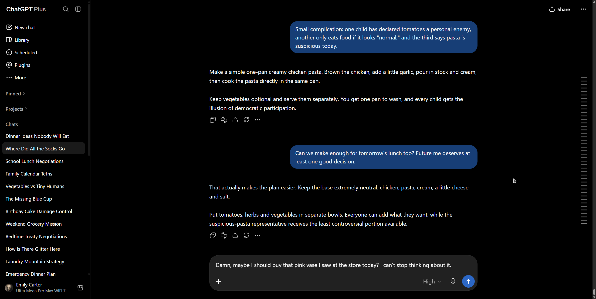
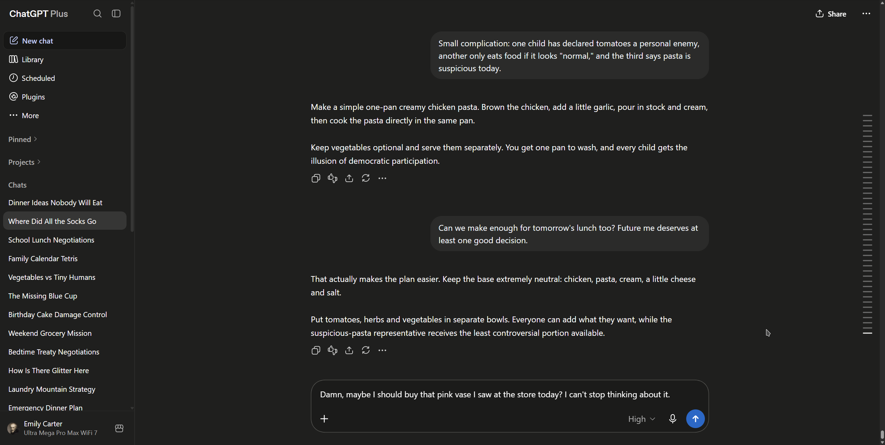

# ChatGPT Graphite for Stylus

A dark graphite style for ChatGPT designed for Stylus. Changes the main interface colors, backgrounds, user messages, text composer, and selected controls.

## Comparison

| Graphite Off | Graphite On |
| --- | --- |
|  |  |

## Features

- Graphite page and sidebar backgrounds
- Dark gray user message bubbles
- Refined text composer background and border
- Restyled New chat button
- Cleaner share and conversation menu controls
- Voice mode top panel matched to the main theme
- Transparent suggestion list background on new chats

## Install

### Stylus

1. Install the Stylus browser extension.
2. Open the raw `chatgpt-graphite.user.css` file from this repository.
3. Stylus should offer to install the userstyle.
4. Save the style and reload ChatGPT.

Direct userstyle file:

https://raw.githubusercontent.com/VicDavis/chatgpt-graphite-for-stylus/main/chatgpt-graphite.user.css

## Compatibility

The style targets the current ChatGPT web interface at `chatgpt.com` and is intended for dark mode.

ChatGPT's interface can change over time. If OpenAI changes class names, data attributes, or layout structure, some selectors may require updates.

## Main colors

- Main background: `#1F1F1E`
- User message bubble: `#2B2B2A`
- Composer background: `#1B1B1A`
- Composer border: `#50504D`
- New chat background: `#171716`
- New chat accent: `#C7D2FF`

## License

MIT
